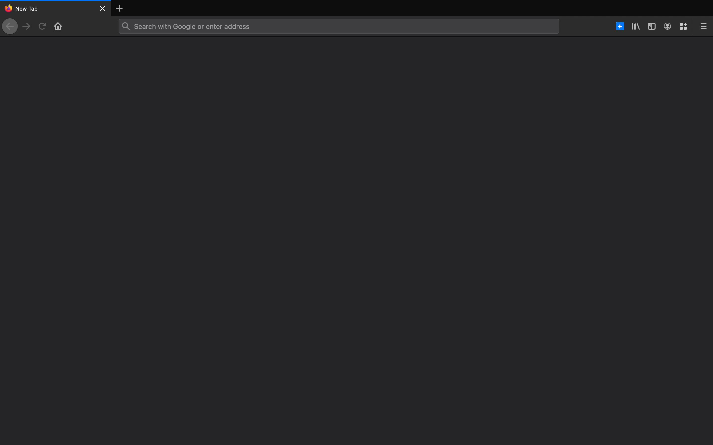

# New Container Tab

https://addons.mozilla.org/en-US/firefox/addon/firefox-new-container-tab/

Opening a new tab in a Firefox container is hell—you have to either press the new tab button or remember obscure, limited shortcuts. New Container Tab changes that: you use the shortcut <kbd>Ctrl</kbd>+<kbd>Shift</kbd>+<kbd>Comma</kbd>, search for a container name, and press <kbd>Enter</kbd>. Furthermore, the container search box auto-suggests, so speed is guaranteed!

## Usage Example

