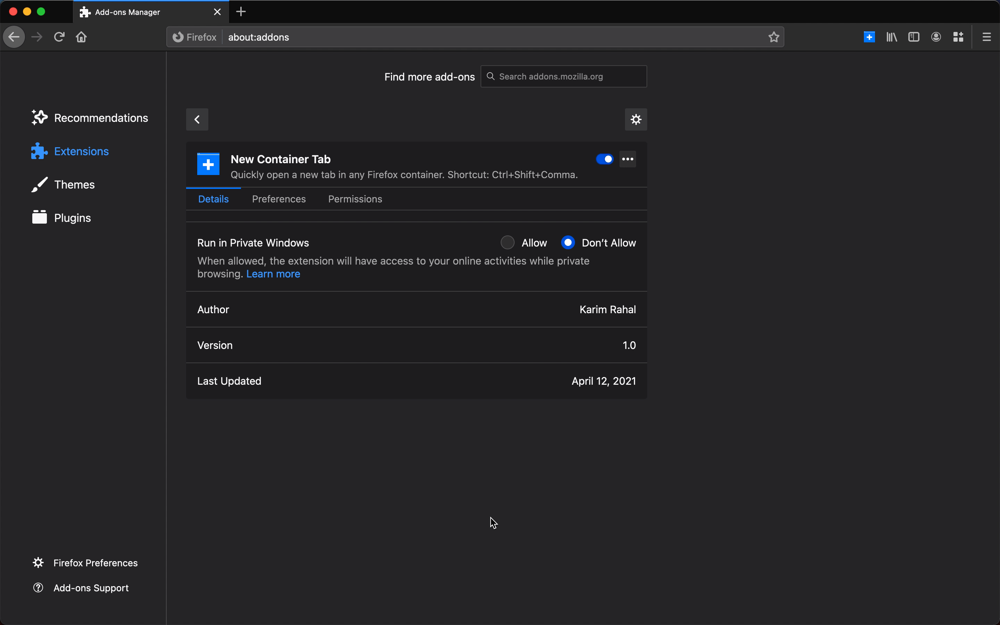

# New Container Tab

https://addons.mozilla.org/en-US/firefox/addon/firefox-new-container-tab/

Opening a new tab in a Firefox container is hell—you have to either hard press the new tab button or remember obscure, limited shortcuts. New Container Tab changes that: you use the shortcut (Windows) <kbd>Ctrl</kbd>+<kbd>Shift</kbd>+<kbd>Comma</kbd> or (macOS) <kbd>Cmd</kbd>+<kbd>Shift</kbd>+<kbd>Comma</kbd>, search for a container name, and press <kbd>Enter</kbd>. Furthermore, the container search box auto-suggests, so speed is guaranteed! You can also enable the option to 'auto-open' tabs once a match is found.

**Note:** You can always change default shortcuts at <code>about:addons</code> > Settings (gear icon) > Manage Extension Shortcuts

## Usage Examples

### With 'auto-open' Enabled

